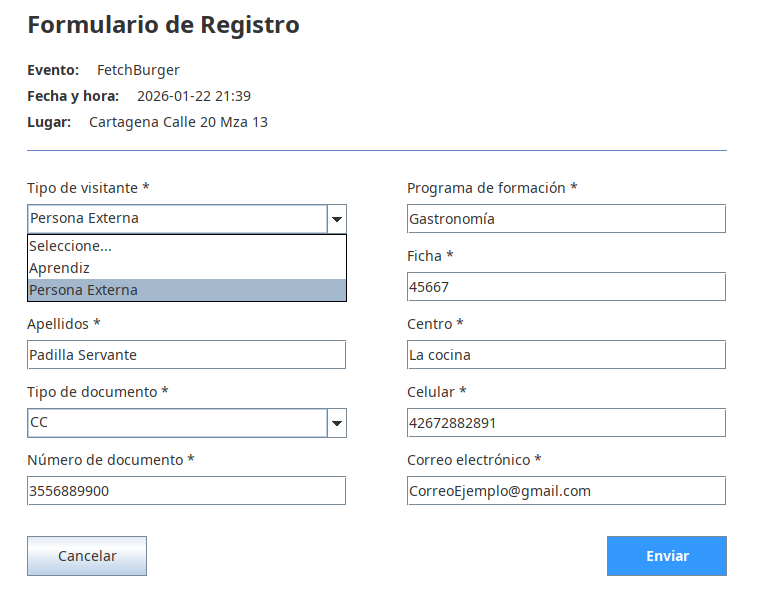
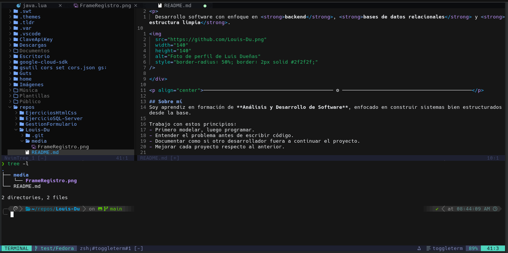

<!-- ====== HEADER ====== -->
<header>
  

    <nav>
      <a href="#sobre-mí">Sobre mí</a> ·
      <a href="#proyectos-destacados">Proyectos destacados</a>
      <a href="#stack">🧰 Stack</a> ·
      <a href="#-estadísticas">📊 Estadísticas</a> ·
      <a href="#contacto">📬 Contacto</a>
    </nav>
  

</header>

<h1>Luis Dueñas</h1>

<strong>Desarrollador de Software en formación</strong>

  Construyo sistemas con enfoque en <strong>backend</strong>, 
<strong>modelado relacional</strong> y <strong>estructura limpia</strong>.

   

## Sobre mí
Soy desarrollador de software en formación enfocado en construir sistemas desde la base.

He desarrollado proyectos aplicando:
- Lógica de programación
- Operaciones CRUD
- Modelado relacional
- Organización modular del código

Tengo conocimientos tanto en **backend** como en **frontend** (HTML, CSS), lo que me permite entender el flujo completo de una aplicación. Sin embargo, mi enfoque principal está en la *lógica del sistema y la estructura interna*.

Trabajo bajo principios simples:
- Entender el problema antes de programar
- Diseñar antes de implementar
- Escribir código claro y mantenible

### Intereses actuales:
- Backend y lógica de sistemas
- SQL Server y modelado relacional
- Estructura y buenas prácticas

## Proyectos destacados

| Proyecto | Descripción Profesional | Stack | Links |
|---|---|---|---|
| Gestión de Formularios | Aplicación en Java para la gestión estructurada de formularios, con validación de datos y organización modular del código usando programación orienta a objetos. | Java |  |
| RedSocialSena | Aplicación web con autenticación y publicaciones en tiempo real integrando frontend dinámico con Firebase. | HTML, CSS, JS, Firebase | Repo |
| Configuración Neovim | Entorno de desarrollo personalizado optimizado para productividad, con configuración modular en Lua y automatización del flujo de trabajo. | Lua, Vim |  |
   
# Stack

## Lenguajes y Web
<table>
  <tr>
    <td align="center" width="96">
      
       Python
    </td>
    <td align="center" width="96">
      
       Java
    </td>
    <td align="center" width="96">
      
       C#
    </td>
    <td align="center" width="96">
      
       JavaScript
    </td>
    <td align="center" width="96">
      
       SQL Server
    </td>
    <td align="center" width="96">
      
       HTML
    </td>
    <td align="center" width="96">
      
       CSS
    </td>
    <td align="center" width="96">
      
       Lua
    </td>
    <td align="center" width="110">
      
       Git
    </td>
    <td align="center" width="96">
      
       Markdown
    </td>
    <td align="center" width="96">
      
       .NET
    </td>
  </tr>
</table>

### Bases de datos y herramientas

## Herramientas
<table>
  <tr>
    <td align="center" width="110">
      
       Bash
    </td>
    <td align="center" width="110">
      
       GitHub
    </td>
    <td align="center" width="110">
      
       VS Code
    </td>
    <td align="center" width="110">
      
       Visual Studio
    </td>
    <td align="center" width="110">
      
       IntelliJ
    </td>
    <td align="center" width="110">
      
       Neovim
    </td>
        <td align="center" width="110">
      
       Jira
    </td>
  </tr>
  <tr>
    <td align="center" width="110">
      
       Azure
    </td>
    <td align="center" width="110">
      
       Firebase
    </td>
    <td align="center" width="110">
      
       Figma
    </td>
    <td align="center" width="110">
      
       Notion
    </td>
    <td align="center" width="110">
      
       Obsidian
    </td>
    <td align="center" width="110">
      
       Vim
    </td>
  </tr>
</table>

## Bases de datos / Modelado
- SQL Server (consultas y modelado)
- Diseño **relacional** y **Entidad–Relación (ER)**
   
## Qué estoy construyendo ahora
- Sistema backend con C# y SQL Server
- Diseño de base de datos relacional desde cero
- Mejora de estructura y documentación en proyectos
- Organización del desarrollo usando Kanban
   
## 📊 Estadísticas

 

## 📬 Contacto

  © 2026 Luis Dueñas · Actualizado: 2026-03-06
    
  
  
  
