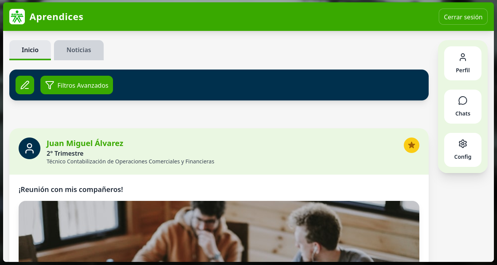

<!-- ====== HEADER ====== -->
<header>
  

    <nav>
      <a href="#-sobre-mí">Sobre mí</a> ·
      <a href="#-proyectos-destacados">🚀 Proyectos</a> ·
      <a href="#-stack-tecnológico">🧰 Stack</a> ·
      <a href="#-estadísticas">📊 Estadísticas</a> ·
      <a href="#-contacto">📬 Contacto</a>
    </nav>
  

</header>

<h1>Luis Dueñas</h1>

<strong>Desarrollador de Software en formación</strong> · Backend · C# / ASP.NET MVC · Java · SQL Server

 

## 👋 Sobre mí

- 🎓 Tecnólogo en Análisis y Desarrollo de Software (SENA) — en formación
- 💻 Enfocado en **backend**, **modelado relacional** y **arquitectura MVC**
- 📱 También trabajo con desarrollo móvil (**Flutter/Dart**) y frontend (HTML, CSS, JavaScript, Node.js)
- 🏆 Logré **98/100 en rendimiento** y **100/100 en buenas prácticas** (Lighthouse) en mi proyecto SGES Web
- 🧠 Principios de trabajo: entender antes de programar, diseñar antes de implementar, escribir código claro y mantenible
- 📫 Contáctame por LinkedIn o correo (botones arriba ⬆️)

 

## 🚀 Proyectos Destacados

<table>
<tr>
<td width="50%" valign="top">

### [SGES Web](https://github.com/Louis-Du/SGESWeb)
Sistema de gestión de eventos e inscripciones. Diseñé la base de datos relacional en SQL Server y el backend con ASP.NET MVC.

**Resultado:** 98/100 en rendimiento y 100/100 en buenas prácticas (Lighthouse).

`C#` `ASP.NET MVC` `SQL Server` `Bootstrap`

</td>
<td width="50%" valign="top">

### [RedSocialSENA](https://github.com/Louis-Du/RedSocialSena)
Red social para aprendices y egresados del SENA. Prototipo en HTML/CSS/JS desplegado en GitHub Pages; versión final en desarrollo con Firebase (auth + tiempo real).

`HTML` `CSS` `JavaScript` `Firebase`

</td>
</tr>
<tr>
<td width="50%" valign="top">

### [Gestión de Formularios](https://github.com/Louis-Du/GestionFormulario)
Aplicación de escritorio en Java para gestión estructurada de formularios, con validación de datos y arquitectura MVC.

`Java` `Java Swing` `Apache POI` `MVC`

</td>
<td width="50%" valign="top">

### [Configuración Neovim](https://github.com/Louis-Du/dotfiles)
Entorno de desarrollo personalizado optimizado para productividad, con configuración modular en Lua.

`Lua` `Neovim`

</td>
</tr>
</table>

 

## 🧰 Stack Tecnológico

**Lenguajes**

**Backend / Web**

**Móvil**

**Bases de datos**

**Control de versiones y metodologías**

**Herramientas personales**

 

## 📊 Estadísticas

 

 

## 📬 Contacto

  
  
  
    
  © 2026 Luis Dueñas · Actualizado: 2026-07-15

