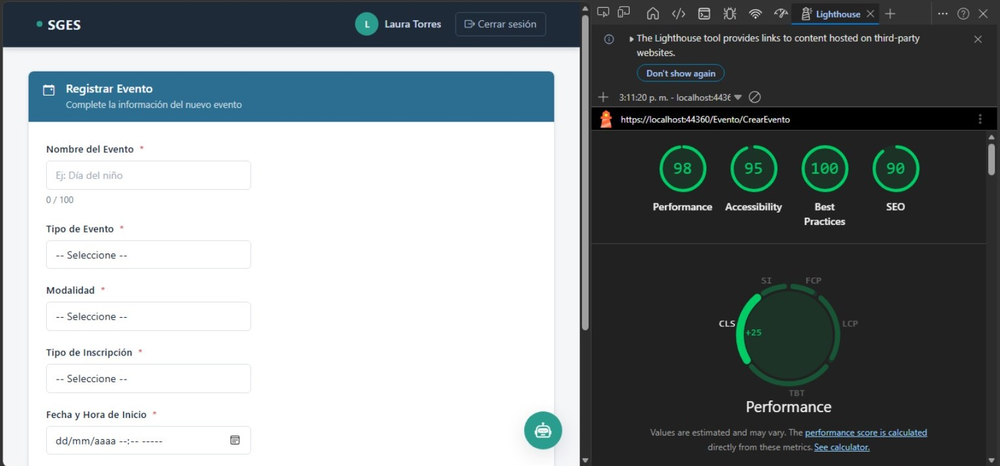

<!-- ====== HEADER ====== -->
<header>
  

    <nav>
      <a href="#-sobre-mí">Sobre mí</a> ·
      <a href="#-proyectos-destacados">🚀 Proyectos</a> ·
      <a href="#-stack-tecnológico">🧰 Stack</a> ·
      <a href="#-estadísticas">📊 Estadísticas</a> ·
      <a href="#-contacto">📬 Contacto</a>
    </nav>
  

</header>

<h1>Luis Dueñas</h1>

<strong>Desarrollador de Software en formación</strong> 

C# • Java • JavaScript • Docker • GitHub Actions • ASP.NET MVC • SQL Server
 

 

## 👋 Sobre mí

- 🎓 Tecnólogo en Análisis y Desarrollo de Software (SENA)

- 💻 Experiencia en proyectos académicos y personales desarrollando aplicaciones web y de escritorio.

- ⚙️ Interesado en arquitectura MVC, APIs REST, bases de datos relacionales y automatización de procesos de desarrollo.

- 🐳 Trabajo con Docker, GitHub Actions (CI), Git/GitHub y pruebas de APIs utilizando Bruno.

- 🏆 98/100 en rendimiento y 100/100 en buenas prácticas (Google Lighthouse).

- 🧠 Disfruto aprender nuevas tecnologías y mejorar continuamente la calidad del software.

 

## 🚀 Proyectos Destacados

<table>
<tr>
<td width="50%" valign="top">

### [FM - Foro de Música](https://github.com/lukasa133/proyecto-foro-musica)
Foro web para compartir música. Configuré y Containericé el entorno de desarrollo con Docker. Diseñé y ejecuté pruebas para APIs REST utilizando Bruno.

`JavaScript` `Node.js` `Docker` `Bruno` `GitHub Actions` `Supabase` `PostgreSQL`

</td>
<td width="50%" valign="top">

### [SGES Web](https://github.com/Louis-Du/SGESWeb)
Sistema de gestión de eventos e inscripciones. Diseñé la base de datos relacional en SQL Server y el backend con ASP.NET MVC.

**Resultado:** 98/100 en rendimiento y 100/100 en buenas prácticas (Lighthouse).

`C#` `ASP.NET MVC` `SQL Server` `Bootstrap`

</td>
</tr>
<tr>
<td width="50%" valign="top">

### [RedSocialSENA](https://github.com/Louis-Du/RedSocialSena)
Red social para aprendices y egresados del SENA. Prototipo en HTML/CSS/JS desplegado en GitHub Pages; versión final en desarrollo con Firebase (auth + tiempo real).

`HTML` `CSS` `JavaScript` `Firebase`

</td>
<td width="50%" valign="top">

### [Gestión de Formularios](https://github.com/Louis-Du/GestionFormulario)
Aplicación de escritorio en Java para gestión estructurada de formularios, con validación de datos y arquitectura MVC.

`Java` `Java Swing` `Apache POI` `MVC`

</td>
</tr>
<td width="50%" valign="top">

### [Configuración Neovim](https://github.com/Louis-Du/dotfiles)
Entorno de desarrollo personalizado optimizado para productividad, con configuración modular en Lua.

`Lua` `Neovim`

</td>
</tr>
</table>

 

## 🧰 Stack Tecnológico

**Lenguajes**

**Frameworks**

**Bases de datos**

**DevOps**

**APIs**

**Herramientas**

 

## 🌱 Actualmente aprendiendo

- Docker y contenedores
- GitHub Actions (CI)
- Node.js
- APIs REST
- PostgreSQL

## 📊 Estadísticas

 

## 📬 Contacto

  
  
  
    
  © 2026 Luis Dueñas · Actualizado: 2026-07-15

